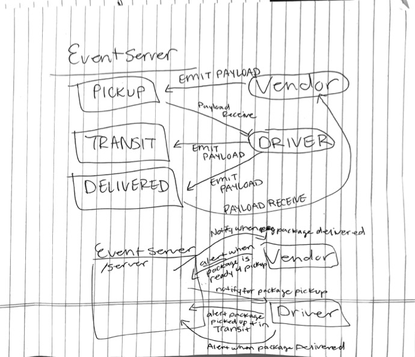

# LABS 11, 12, 13

## Project: repo caps-11

### Author: Elizabeth Hammes

### Problem Domain

* Event Driven Applications (Lab 11)
  * Begin the build of an application for a product called CAPS - The Code Academy Parcel Service. In this sprint, we’ll build out a system that emulates a real world supply chain. CAPS will simulate a delivery service where vendors (such a flower shops) will ship products using our delivery service and when our drivers deliver them, each vendor will be notified that their customers received what they purchased.
  * This will be an event driven application that “distributes” the responsibility for logging to separate modules, using only events to trigger logging based on activity.
* Socket.io (Lab 12)
  * Continue working on a multi-day build of our delivery tracking system, creating an event observable over a network with Socket.io.
  * In this phase, we’ll be moving away from using Node Events for managing a pool of events, instead refactoring to using the Socket.io libraries. This allows communication between Server and Client applications.
  * The intent here is to build the data services that would drive a suite of applications where we can see pickups and deliveries in real-time.
* Message Queues (Lab 13)
  * Complete work on a multi-day build of our delivery tracking system, adding queued delivery.
  * In this phase, we are going to implement a system to guarantee that notification payloads are read by their intended subscriber. Rather than just triggering an event notification and hope that client applications respond, we’re going to implement a “Queue” system so that nothing gets lost. Every event sent will be logged and held onto by the server until the intended recipient acknowledges that they received the message. At any time, a subscriber can get all of the messages they might have missed.
  * In this final phase, we’ll be implementing a “Queue” feature on the Server, allowing Driver and Vendor clients to subscribe to messages added to pickup and delivered queues.

### Links and Resources

* [ci/cd](https://github.com/ehammes/caps-11/actions) (GitHub Actions)
* [back-end server Heroku]() (Heroku) - TBD

### Setup

#### `.env` requirements

N/A

#### How to initialize/run your application

* server - `node src/server/index.js`
* vendor - `node src/clients/driver/index.js`
* driver - `node src/clients/vendor/index.js`

#### UML Diagram

#### Features / User Stories

* The following user/developer stories detail the major functionality for this phase of the project.
  * As a vendor, I want to alert the system when I have a package to be picked up.
  * As a driver, I want to be notified when there is a package to be delivered.
  * As a driver, I want to alert the system when I have picked up a package and it is in transit.
  * As a driver, I want to alert the system when a package has been delivered.
  * As a vendor, I want to be notified when my package has been delivered.

* And as developers, here are some of the development stories that are relevant to the above.
  * As a developer, I want to use industry standards for managing the state of each package.
  * As a developer, I want to create an event driven system so that I can write code that happens in response to events, in real time.
  * As a developer, I want to create network event driven system using Socket.io so that I can write code that responds to events originating from both servers and client applications
* Lab 13 updated stories:
  * Vendor/Driver:
    * As a vendor, I want to “subscribe” to “delivered” notifications so that I know when my packages are delivered.
    * As a vendor, I want to “catch up” on any “delivered” notifications that I might have missed so that I can see a complete log.
    * As a driver, I want to “subscribe” to “pickup” notifications so that I know what packages to deliver.
    * As a driver, I want to “catch up” on any “pickup” notifications I may have missed so that I can deliver everything.
    * As a driver, I want a way to “scan” a delivery so that the vendors know when a package has been delivered.
  * Developer:
    * As a developer, I want to create a system of tracking who is subscribing to each event.
    * As a developer, I want to place all inbound messages into a “queue” so that my application knows what events are to be delivered.
    * As a developer, I want to create a system for communicating when events have been delivered and received by subscribers.
    * As a developer, I want to delete messages from the queue after they’ve been received by a subscriber, so that I don’t re-send them.
    * As a developer, I want to create a system for allowing subscribers to retrieve all undelivered messages in their queue.

#### Tests

* Run tests using `npm test`
